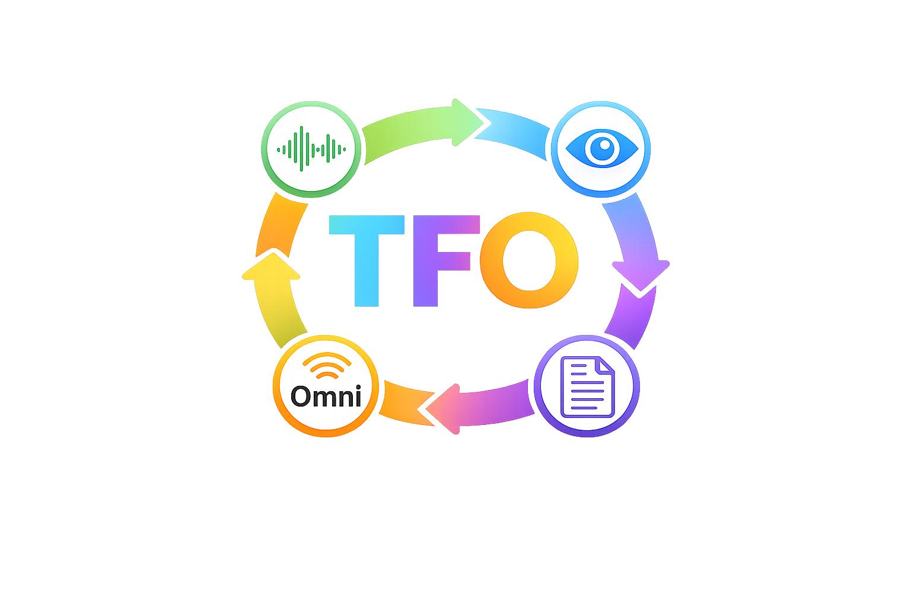
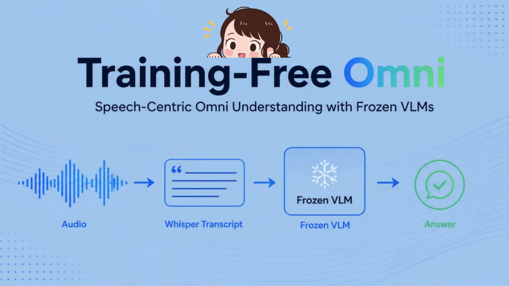

<div align="center">



# Training-Free Speech-Centric Omni Understanding with Frozen VLMs

### [Ankan Deria](https://scholar.google.com/citations?user=M-TzFkYAAAAJ&hl=en&oi=sra), [Hanoona Abdul Rasheed](https://scholar.google.com/citations?user=yhDdEuEAAAAJ&hl=en&oi=ao), [Xilin He](https://scholar.google.com/citations?hl=en&user=LRdrMfoAAAAJ&view_op=list_works&sortby=pubdate), [Fahad Shahbaz Khan](https://scholar.google.com/citations?user=zvaeYnUAAAAJ&hl=en), [Salman Khan](https://scholar.google.com/citations?user=M59O9lkAAAAJ&hl=en)

### **Mohamed bin Zayed University of Artificial Intelligence**

[](https://arxiv.org/abs/XXXX.XXXXX)
[](https://YOUR_PROJECT_WEBSITE_URL)

</div>

---

## 💡 Training-Free Omni

Training-Free Omni equips frozen vision-language models with speech-centric
omni understanding without model training. It converts speech into structured
textual evidence and combines it with image or video inputs through a unified
evaluation pipeline.

<p align="center">
  <a href="assets/teaser_TFO.mp4">
    
  </a><br>
  <em>Click the image to watch the teaser video.</em>
</p>

---

## 🔥 Highlights

- **Training-free:** extends frozen VLMs to speech-centric omni understanding without fine-tuning.
- **Unified multimodal evaluation:** supports text, image, video, audio, and audio-visual tasks.
- **Broad model coverage:** includes Qwen, Gemma, MiniCPM, VILA, and OmniVinci adapters.
- **Broad benchmark coverage:** provides 118 dataset adapters with shared evaluation and reporting.
- **Optional spoken output:** combines multimodal answers with CosyVoice3 speech synthesis.

---

## 🚀 Quick Start

### Installation

Python 3.10+ and `ffmpeg` are recommended. Install the correct PyTorch build
for your CPU, CUDA, or ROCm platform first.

```bash
python3 -m venv .venv
source .venv/bin/activate
python3 -m pip install --upgrade pip
python3 -m pip install -r requirements.txt
```

The root `requirements.txt` is consolidated. Some model adapters retain their
own environment instructions; follow the selected adapter's README when
provided.

### Run an Evaluation

Run all commands from the repository root:

```bash
MODEL=qwen25omni \
MODEL_PATH=Qwen/Qwen2.5-Omni-3B \
EVAL_DATASETS=daily_omni \
DATA_DIR=data/daily_omni \
OUTPUT_DIR=results/qwen25omni \
LLM_JUDGE=False \
bash eval.sh
```

Use comma-separated names to evaluate multiple datasets:

```bash
EVAL_DATASETS="daily_omni,omnibench,av_odyssey" \
MODEL=qwen25omni \
MODEL_PATH=Qwen/Qwen2.5-Omni-3B \
OUTPUT_DIR=results/qwen25omni \
bash eval.sh
```

For a short smoke test, add `MAX_SAMPLES=3`. Set `RESUME=True` to continue an
interrupted run.

### Model Configurations

Use the evaluation command above and replace `MODEL` and `MODEL_PATH` with one
of the following configurations.

| Model | `MODEL` | `MODEL_PATH` | Additional setting |
| --- | --- | --- | --- |
| Qwen2.5-Omni | `qwen25omni` | `Qwen/Qwen2.5-Omni-3B` | Native audio/image/video input |
| Qwen2.5-VL + speech | `qwen25vlomni_advance` | `Qwen/Qwen2.5-VL-3B-Instruct` | `QWEN25VL_USE_ASR=True` |
| Qwen3.5 | `qwen35omni` | `Qwen/Qwen3.5-2B` | For separate audio: `QWEN35OMNI_USE_ASR=True` |
| Qwen3-Omni 30B | `qwen3omni30b` | Qwen3-Omni checkpoint or model ID | `QWEN3OMNI_USE_AUDIO_IN_VIDEO=True` |
| Qwen3-VL 30B + Whisper | `qwen3vl30b_whisper` | Qwen3-VL checkpoint or model ID | Whisper-enabled adapter |
| Gemma 4 | `gemma4e2b` | `google/gemma-4-E2B-it` | Image/video understanding |
| Gemma 4 + Whisper | `gemma4e2b_whisper` | `google/gemma-4-E2B-it` | Speech-enabled adapter |
| MiniCPM-o 4.5 | `minicpmo45` | `openbmb/MiniCPM-o-4_5` | Set `MINICPMO45_INIT_TTS=False` for evaluation |
| MiniCPM-V 4.5 + Whisper | `minicpmv45_whisper` | `openbmb/MiniCPM-V-4_5` | Speech-enabled adapter |
| VILA-HD + Whisper | `VILA_whisper` | `nvidia/NVILA-8B-HD-Video` | Requires an AutoGaze checkpoint |
| NVILA + Whisper | `VILA_whisper_1` | `Efficient-Large-Model/NVILA-8B-Video` | Requires VILA-specific dependencies |
| OmniVinci | `omnivinci` | Local OmniVinci checkpoint | Set `OMNIVINCI_MODEL_PATH` |

Model IDs may be replaced with local checkpoint paths for offline evaluation.

### Direct Python Evaluation

```bash
python3 run_eval.py \
  --model qwen25omni \
  --model_path Qwen/Qwen2.5-Omni-3B \
  --dataset daily_omni \
  --data_dir data/daily_omni \
  --output_dir results/qwen25omni \
  --llm_judge False
```

### End-to-End Text and Speech Output

Prepare CosyVoice3 once:

```bash
bash End_to_End_Model/setup_cosyvoice3.sh
```

Then run multimodal inference with text and spoken output:

```bash
python3 End_to_End_Model/run_qwen25vlomni_advance.py \
  --video path/to/video.mp4 \
  --audio path/to/audio.wav \
  --question "What happens in this video?" \
  --output-mode both \
  --output-audio outputs/answer.wav
```

---

## 📊 Evaluation Outputs

Each run writes:

```text
<OUTPUT_DIR>/<dataset>/predictions.jsonl
<OUTPUT_DIR>/<dataset>/summary.json
<OUTPUT_DIR>/all_results.csv
```

Dataset names correspond to folders under `datasets/`. Model names correspond
to folders under `models/`. Model checkpoints and benchmark data are not
included in this repository.

---

## 📜 Citation

```bibtex
@article{deria2026trainingfree,
  title={Training-Free Speech-Centric Omni Understanding with Frozen VLMs},
  author={Deria, Ankan and Abdul Rasheed, Hanoona and He, Xilin and Khan, Fahad Shahbaz and Khan, Salman},
  journal={arXiv preprint},
  year={2026}
}
```

---

<p align="center">
  <a href="https://mbzuai.ac.ae">
    
  </a>
</p>
